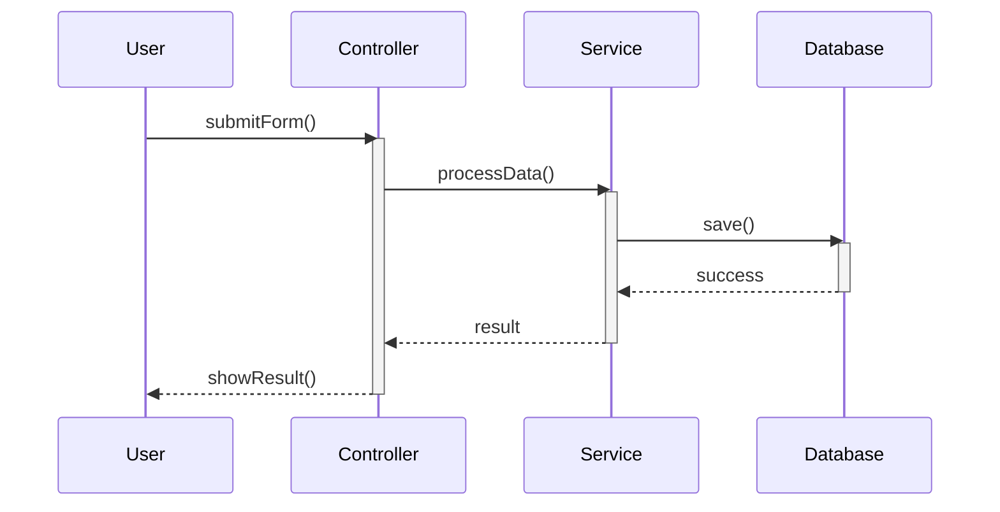
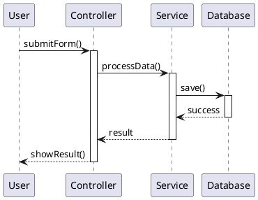

# Hướng dẫn vẽ Sequence Diagram

## Giới thiệu

Sequence Diagram (Sơ đồ trình tự) là một loại biểu đồ UML mô tả cách các đối tượng tương tác với nhau theo thời gian. Nó cho thấy luồng thông điệp (messages) giữa các đối tượng trong một hệ thống.

## Các thành phần cơ bản

### 1. Actor (Người dùng/Hệ thống bên ngoài)
- Đại diện cho người dùng hoặc hệ thống bên ngoài tương tác với hệ thống
- Thường được vẽ ở góc trái của diagram
- Ví dụ: User, External System

### 2. Lifeline (Đường đời)
- Đường thẳng đứng đại diện cho một đối tượng trong suốt thời gian tồn tại
- Mỗi đối tượng có một lifeline riêng
- Ví dụ: LoginController, ChatClient, Server

### 3. Activation Box (Hộp kích hoạt)
- Hình chữ nhật mỏng trên lifeline
- Cho biết đối tượng đang thực thi một phương thức
- Thời gian kích hoạt = thời gian đối tượng đang hoạt động

### 4. Messages (Thông điệp)
- Mũi tên nằm ngang giữa các lifeline
- Đại diện cho việc gọi phương thức hoặc gửi thông điệp
- Các loại:
  - **Synchronous** (→): Gọi phương thức và đợi kết quả
  - **Asynchronous** (→→): Gửi thông điệp không đợi kết quả
  - **Return** (--→): Trả về kết quả

### 5. Self Message (Thông điệp tự gọi)
- Mũi tên uốn cong trên cùng một lifeline
- Đối tượng gọi phương thức của chính nó

### 6. Notes (Ghi chú)
- Hộp văn bản để giải thích thêm
- Có thể đặt ở bất kỳ đâu trong diagram

## Cách đọc Sequence Diagram

1. **Đọc từ trên xuống dưới**: Thời gian trôi từ trên xuống
2. **Theo dõi các mũi tên**: Mỗi mũi tên là một tương tác
3. **Xem activation boxes**: Cho biết đối tượng nào đang hoạt động
4. **Chú ý return messages**: Cho biết khi nào phương thức trả về

## Best Practices

### 1. Đặt tên rõ ràng
- Đặt tên đối tượng và phương thức dễ hiểu
- Sử dụng tên từ code thực tế khi có thể

### 2. Tổ chức hợp lý
- Đặt các đối tượng quan trọng nhất ở bên trái
- Nhóm các đối tượng liên quan gần nhau

### 3. Tránh quá phức tạp
- Mỗi diagram nên tập trung vào một use case cụ thể
- Nếu quá phức tạp, chia thành nhiều diagram nhỏ hơn

### 4. Bao gồm error handling
- Hiển thị các luồng xử lý lỗi
- Cho thấy cách hệ thống xử lý exception

### 5. Sử dụng fragments
- **alt**: Các trường hợp thay thế (if/else)
- **loop**: Vòng lặp
- **opt**: Tùy chọn (optional)
- **par**: Song song (parallel)

## Các format phổ biến

### 1. Mermaid
- Syntax đơn giản, dễ viết
- Hỗ trợ tốt trên GitHub, GitLab
- Render trực tiếp trong Markdown

### 2. PlantUML
- Syntax mạnh mẽ, nhiều tính năng
- Hỗ trợ styling và colors
- Cần tool để render (extension hoặc online)

### 3. Text Description
- Mô tả bằng văn bản
- Dễ hiểu cho người mới
- Có thể dùng để vẽ thủ công

## Ví dụ đơn giản

### Mermaid

### PlantUML

## Tài liệu tham khảo

- [UML Sequence Diagrams](https://www.uml-diagrams.org/sequence-diagrams.html)
- [Mermaid Sequence Diagram](https://mermaid.js.org/syntax/sequenceDiagram.html)
- [PlantUML Sequence Diagram](https://plantuml.com/sequence-diagram)

## Các ví dụ trong Zalu

Xem các file trong thư mục `docs/diagrams/` để xem các ví dụ cụ thể:
- `login-sequence.md`: Flow đăng nhập
- `send-message-sequence.md`: Flow gửi tin nhắn
- `voice-message-sequence.md`: Flow gửi voice message

